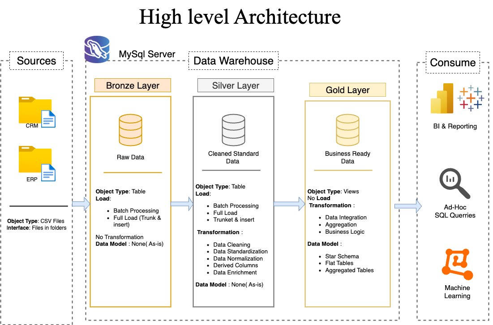
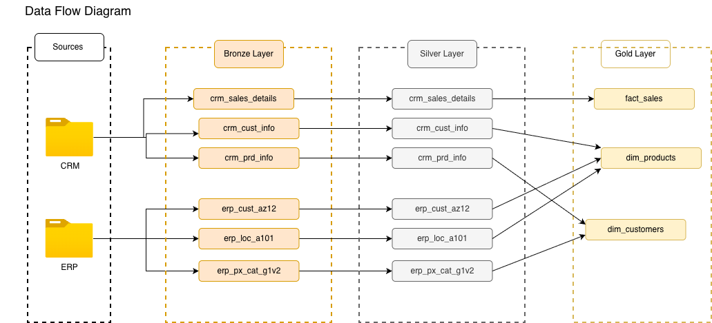

# MySQL Data Warehouse ETL Project

A complete **Data Warehouse ETL project built using MySQL**, implementing a modern **Medallion Architecture (Bronze → Silver → Gold)** for transforming raw ERP and CRM data into business-ready analytical datasets.

This project demonstrates practical **data engineering concepts**, including ETL pipeline development, data cleansing, dimensional modeling, SQL-based validation, and analytical reporting.

---

## Project Overview

This project builds a modern data warehouse using **MySQL Server** by integrating data from multiple business source systems:

- **CRM System** → Customer, Product, Sales data
- **ERP System** → Customer details, Product categories, Location data

The pipeline follows a layered architecture:

- **Bronze Layer** → Raw ingestion
- **Silver Layer** → Data cleansing & transformation
- **Gold Layer** → Star schema analytical views

Final outputs are optimized for:

- BI Dashboards
- Ad-hoc SQL Analysis
- Reporting
- Machine Learning / Analytics workloads

---

# Architecture

## High-Level Architecture



### Layer Explanation

### Bronze Layer (Raw Data)
Purpose:
Store source data exactly as received without transformations.

Characteristics:
- Raw CSV ingestion
- Full load processing
- Truncate & Insert strategy
- No business logic
- Acts as landing zone

Tables:
- `bronze_crm_cust_info`
- `bronze_crm_prd_info`
- `bronze_crm_sales_details`
- `bronze_erp_cust_az12`
- `bronze_erp_loc_a101`
- `bronze_erp_px_cat_g1v2`

---

### Silver Layer (Cleaned & Standardized Data)
Purpose:
Clean, standardize, validate, and enrich raw data.

Transformations:
- Remove duplicates
- Handle null values
- Standardize gender values
- Standardize marital status
- Trim unwanted spaces
- Correct invalid date ranges
- Normalize product/customer records
- Data enrichment
- Derived columns

Tables:
- `silver_crm_cust_info`
- `silver_crm_prd_info`
- `silver_crm_sales_details`
- `silver_erp_cust_az12`
- `silver_erp_loc_a101`
- `silver_erp_px_cat_g1v2`

---

### Gold Layer (Business Ready Data)
Purpose:
Provide analytical datasets for reporting and decision making.

Features:
- Star schema design
- Dimension views
- Fact views
- Integrated business logic
- Reporting optimized datasets

Views:
- `gold_dim_customers`
- `gold_dim_products`
- `gold_fact_sales`

---

# Data Flow

## ETL Flow Diagram



Pipeline flow:

**Source CSV Files**
↓  
**Bronze Layer (Raw Tables)**
↓  
**Silver Layer (Cleaned Tables)**
↓  
**Gold Layer (Analytical Views)**

---

# Tech Stack

Database:
- MySQL Server

Language:
- SQL

ETL Concepts:
- Batch Processing
- Stored Procedures
- Data Cleansing
- Data Standardization
- Data Quality Validation
- Dimensional Modeling
- Star Schema Design

Tools:
- MySQL Workbench
- Git
- GitHub
- Draw.io

---

# Project Structure

```bash
mysql-data-warehouse-etl/
│
├── datasets/
│   ├── source_crm/
│   └── source_erp/
│
├── docs/
│   ├── data_architecture.png
│   ├── data_flow_diagram.png
│
├── scripts/
│   ├── init_database.sql
│   ├── ddl_bronze.sql
│   ├── proc_load_bronze.sql
│   ├── ddl_silver_layer.sql
│   ├── proc_load_silver.sql
│   ├── ddl_gold.sql
│   ├── quality_checks_silver.sql
│   └── quality_check_gold.sql
│
└── README.md
```

---

# Database Design

## Source Systems

### CRM Data
Contains:
- Customer information
- Product information
- Sales transaction details

Files:
- `cust_info.csv`
- `prd_info.csv`
- `sales_details.csv`

---

### ERP Data
Contains:
- Customer master data
- Location details
- Product category mapping

Files:
- `cust_az12.csv`
- `loc_a101.csv`
- `px_cat_g1v2.csv`

---

# ETL Implementation

## Step 1: Initialize Database

Creates:
- `DataWarehouse` database

Run:

```sql
SOURCE init_database.sql;
```

---

## Step 2: Create Bronze Layer Tables

Creates raw staging tables.

Run:

```sql
SOURCE ddl_bronze.sql;
```

---

## Step 3: Load Bronze Layer

Loads CSV files into bronze tables.

Features:
- Batch timing logs
- Start/end timestamps
- Row count validation
- Full reload strategy

Run:

```sql
SOURCE proc_load_bronze.sql;
```

---

## Step 4: Create Silver Layer Tables

Creates cleaned staging tables.

Run:

```sql
SOURCE ddl_silver_layer.sql;
```

---

## Step 5: Load Silver Layer

Transforms bronze data into standardized silver tables.

Features:
- Data cleansing
- Standardization
- Business rule transformations
- Error handling using SQL exception handlers
- Logging

Run:

```sql
SOURCE proc_load_silver.sql;
```

Execute:

```sql
CALL load_silver_layer();
```

---

## Step 6: Create Gold Layer Views

Build analytical star schema views.

Run:

```sql
SOURCE ddl_gold.sql;
```

---

# Data Quality Validation

## Silver Layer Checks

Script:
```sql
quality_checks_silver.sql
```

Validations:
- NULL checks
- Duplicate checks
- Data consistency checks
- Date validation
- Invalid date order detection
- Standardization verification
- Sales consistency validation

Run:

```sql
SOURCE quality_checks_silver.sql;
```

---

## Gold Layer Checks

Script:
```sql
quality_check_gold.sql
```

Validations:
- Duplicate customer/product keys
- NULL dimension keys
- Fact-to-dimension integrity checks
- Business rule validation
- Data consistency checks

Run:

```sql
SOURCE quality_check_gold.sql;
```

---

# Star Schema

## Fact Table

### gold_fact_sales
Measures:
- Sales amount
- Quantity sold
- Product sales metrics

---

## Dimension Tables

### gold_dim_customers
Contains:
- Customer details
- Demographics
- Standardized customer attributes

---

### gold_dim_products
Contains:
- Product information
- Categories
- Product business metadata

---

# Business Use Cases

This warehouse can be used for:

- Sales trend analysis
- Product performance tracking
- Customer segmentation
- Business intelligence dashboards
- KPI reporting
- Revenue analytics
- Forecasting models
- Machine learning pipelines

---

# Key Learnings

This project demonstrates hands-on experience with:

- Data Warehousing
- ETL Pipeline Development
- MySQL Stored Procedures
- SQL Transformations
- Data Quality Engineering
- Dimensional Modeling
- Star Schema Implementation
- Production-style SQL scripting
- Logging & monitoring ETL jobs

---

# How to Run

Execute scripts in this order:

```text
1. init_database.sql
2. ddl_bronze.sql
3. proc_load_bronze.sql
4. ddl_silver_layer.sql
5. proc_load_silver.sql
6. CALL load_silver_layer();
7. ddl_gold.sql
8. quality_checks_silver.sql
9. quality_check_gold.sql
```

---

# Sample Outputs

Final outputs include:

- Clean customer dimensions
- Product dimensions
- Fact sales analytical dataset
- Quality validation reports
- ETL execution logs

---

# Future Improvements

Possible enhancements:

- Incremental loading
- Change Data Capture (CDC)
- Historical SCD Type 2 tracking
- ETL orchestration with Airflow
- Power BI dashboard integration
- Dockerized deployment
- Automated testing pipelines
- Cloud deployment (AWS / Azure)

---

# Author

**Viresh Kamlapure**

Engineering Student | Data Engineering Enthusiast | SQL & Analytics Learner

---

# License

This project is for educational and portfolio purposes.
